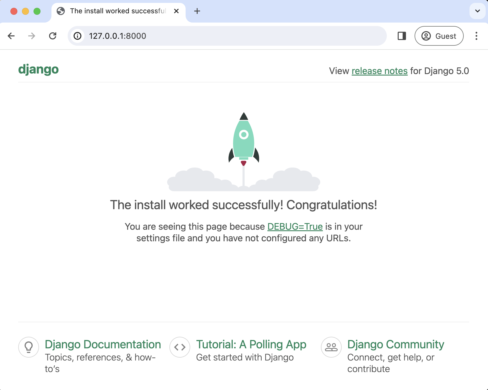

### 第 1 章：初始设置

本章重点介绍如何配置 Windows 或 macOS 电脑，以便进行 Django 项目开发。你可能迫不及待地想要开始，但现在正确配置电脑，日后会为你省去许多麻烦。

你或许渴望立刻深入学习并开始使用 Django，但为 Django 开发配置电脑是一项一次性任务，未来会带来诸多好处。熟悉命令行和 Shell 命令、了解如何使用虚拟环境、安装最新版本的 Python、使用文本编辑器以及运用 Git 进行版本控制都很重要。在本章结束时，你将从头创建自己的第一个 Django 项目，并且只需敲几下键盘，就能创建和修改新的 Django 项目。

#### 命令行

命令行是一种纯文本界面，可追溯到计算机发展的早期。如果你曾在电视节目或电影中看到黑客在黑色窗口中疯狂打字，那就是命令行。它是大多数计算机用户熟悉的基于鼠标或手指操作的图形用户界面的替代方式。普通计算机用户通常无需使用命令行，但对于软件开发人员而言，它是一个至关重要且经常使用的工具，用于执行程序、安装软件、使用 Git 进行版本控制以及连接到云服务器。通过练习，大多数开发人员会发现命令行是一种更快速、更强大的导航和控制计算机的方式。

鉴于命令行的用户界面极为简洁，只有一个空白屏幕和一个闪烁的光标，这会让新手望而却步。命令运行后往往没有反馈，而且如果不小心，一个命令就可能清空整个计算机的内容，并且不会弹出任何警告！因此，使用命令行时要格外小心。不要盲目复制和粘贴在网上找到的命令，只信赖可靠的资源。在日常使用中，有多个术语指代命令行：命令行界面（CLI）、控制台、终端、Shell 或提示符。从技术上讲，终端是打开一个新窗口以访问命令行的程序，控制台是一个基于文本的应用程序，而 Shell 是在底层操作系统上运行命令的程序。提示符是输入和运行命令的地方。一开始很容易被这些术语弄混淆，但它们本质上都指的是：命令行是我们在计算机上运行和执行纯文本命令的地方。

Windows 系统内置的终端和 Shell 都叫 PowerShell。要打开它，找到屏幕底部 Windows 按钮旁边的任务栏，输入“PowerShell”来启动应用程序。它会打开一个新窗口，背景为深蓝色，在“>”提示符后有一个闪烁的光标。这是在我电脑上的显示样子：

```shell
PS C:\Windows\System32>
```

提示符前的“PS”代表 PowerShell，接着是 Windows 操作系统的初始 C 盘目录，然后是 Windows 目录，其中还有 System32 目录。此时，无需担心“>”提示符左边的内容，它会因每台电脑而异，并且稍后可以自定义。后续在 Windows 系统中，我们将使用更简短的“>”提示符。

此时，我们需要导航到用户目录，所以输入命令“cd \users”，然后按回车键，将目录切换（cd）到用户目录。

```shell
PS C:\Windows\System32> cd \users
PS C:\Users>
```

在 macOS 系统中，内置的终端叫“Terminal”。可以通过聚焦搜索（Spotlight）应用程序打开它：同时按下 Command 键和空格键，然后输入“terminal”。或者，打开一个新的访达（Finder）窗口，导航到“Applications”目录，向下滚动打开“Utilities”目录，然后双击“Terminal”应用程序。它默认会打开一个白色背景的新屏幕，在“%”提示符后有一个闪烁的光标。无需担心“%”提示符左边的内容，它因电脑而异，稍后可以自定义。

```shell
Wills-Macbook-Pro:~ wsv%
```

自 2019 年起，macOS 的默认 Shell 是 [zsh](https://en.wikipedia.org/wiki/Z_shell)[^15]，它使用“%”作为提示符。如果你看到的提示符是“$”，那么你使用的是之前 macOS 的默认 Shell——[Bash](https://en.wikipedia.org/wiki/Bash_(Unix_shell))[^16]。虽然本书中的大多数命令在这两种 Shell 中都可以互换使用，但如果你的电脑仍在使用 Bash，建议在网上查找如何通过系统偏好设置切换到 zsh。

注意：在本书中，我们将对所有 Shell 命令使用通用的 Unix“$”提示符，而不是在 Windows 系统中用“>”、在 macOS 系统中用“%”来交替显示。

#### Shell 命令

可用的 Shell 命令有很多，但开发人员日常通常只依赖大约半打命令，需要时再查找更复杂的命令。在大多数情况下，Windows（PowerShell）和 macOS 的命令相似。例如，“whoami”命令在 Windows 系统中返回计算机名/用户名，在 macOS 系统中返回用户名。和所有 Shell 命令一样，输入命令后按回车键执行。注意，“#”符号代表注释，不会在命令行中执行。

```shell
# Windows
$ whoami
wsv2024/wsv
# macOS
$ whoami
wsv
```

在计算机文件系统中导航是常见的命令行操作。在 Windows 和 macOS 系统中，“pwd”（打印工作目录）命令会输出当前在文件系统中的位置。

```shell
# Windows $ pwd
Path
C:\Users
# macOS $ pwd
/Users/wsv
```

你可以将 Django 代码保存在任何地方，但为了方便起见，我们将代码放在桌面目录。在这两个系统中，“cd”（更改目录）命令后面跟上目标位置即可实现目录切换。在 Windows 系统中，你首先需要切换到用户目录，这可以通过“whoami”命令来表示。在我的计算机上，用户目录是“wsv”，但你的可能不同。

```shell
# Windows
$ cd wsv
$ cd onedrive\desktop
$ pwd
Path
C:\Users\wsv\onedrive\desktop
# macOS
$ cd desktop
$ pwd
/Users/wsv/desktop
```

提示：在 Windows 系统中按“>”键，在 macOS 系统中按 Tab 键，可以自动补全命令。所以，如果你输入“cd d”，然后按“>”键或 Tab 键，命令的其余部分会自动补全。

要创建一个新目录，使用“mkdir”命令，后面跟上目录名。我们将在桌面上创建一个“code”目录，并在其中创建一个名为“ch1-setup”的新目录。

```shell
# Windows
$ mkdir code
$ cd code $ mkdir ch1-setup
$ cd ch1-setup
# macOS
$ mkdir code $ cd code $ mkdir ch1-setup
$ cd ch1-setup
```

你可以通过查看桌面或运行“pwd”命令来检查目录是否创建成功。

```shell
# Windows
$ pwd
Path
C:\Users\wsv\onedrive\desktop\code\ch1-setup
# macOS
$ pwd /Users/wsv/desktop/code/ch1-setup
```

提示：“clear”命令将清除终端中之前的命令和输出，让界面更整洁。如前所述，Tab 键可自动补全命令行。“↑”和“↓”键可以循环浏览之前输入的命令，避免重复输入相同内容。要退出终端，你可以用鼠标关闭窗口，但更“黑客”的做法是使用 Shell 命令“exit”，在 Windows 系统中该命令默认可用；在 macOS 系统中，需要更改终端的偏好设置。点击屏幕顶部的“Terminal”，然后从下拉菜单中选择“Preferences”。点击顶部菜单中的“Profiles”，再从下面的列表中选择“Shell”。在“When the shell exits”处有一个单选按钮，选择“Close the window”。

```Shell
$ exit
```

通过练习，命令行操作电脑比使用鼠标效率高得多。完成本书的学习，你无需成为命令行专家：每次我都会提供具体的操作指令。但如果你感兴趣，每个操作系统的完整 Shell 命令列表可在 ss64.com 上查看。

#### 在 Windows 系统上安装 Python 3

在 Windows 系统中，微软在应用商店中提供了 Python 3 的社区版本。在屏幕底部的搜索栏中输入“python”，在应用商店中选择“Python 3.12”的搜索结果，点击蓝色的“获取”按钮进行下载。

要确认 Python 是否安装正确，打开一个新的 PowerShell 终端窗口，输入“python --version”。

```Shell
$ python --version Python 3.12.3
```

结果应该至少是 Python 3.12。然后，输入“python”，从命令行 Shell 中打开 Python 解释器。

```Shell
$ python
Python 3.12.3 (v3.12.3:f6650f9ad7, Apr 9 2024, 08:18:47)
[MSC v.1937 64 bit (AMD64)] on win32
Type "help", "copyright", "credits" or "license" for more information.
```

你可以通过输入“exit()”或按 Ctrl-Z 再按回车键退出 Python 解释器。

#### 在 Mac 系统上安装 Python 3

在 Mac 系统中，从 Python 官方网站下载安装程序是最佳选择。在新的浏览器窗口中，访问 [Python 下载页面](https://www.python.org/downloads/)[^17]，点击“Download the latest version for Mac OS X.”下方的按钮。在撰写本文时，最新版本是 Python 3.12。安装包会保存在“下载”目录中：双击它启动 Python 安装程序，然后按照提示进行操作。

要确认下载是否成功，打开一个新的终端窗口，输入“python3 --version”。

```Shell
$ python3 --version Python 3.12.3
```

然后，输入“python3”打开 Python 解释器。

```Shell
$ python3
Python 3.12.3 (v3.12.3:f6650f9ad7, Apr 9 2024, 08:18:47)
[Clang 13.0.0 (clang-1300.0.29.30)] on darwin
Type "help", "copyright", "credits" or "license" for more information.
>>>
```

你可以通过输入“exit()”或按 Ctrl-D 再按回车键退出 Python 解释器。

#### Python 交互模式

在命令行中，Windows 系统输入“python”，macOS 系统输入“python3”，即可打开 Python 解释器，也称为 Python 交互模式。新出现的“>>>”提示符表明你现在进入了 Python 环境，而不是在命令行中。如果你尝试运行之前的 Shell 命令，如“cd”“ls”“mkdir”，将会报错。此时可以运行真正的 Python 代码，例如，尝试输入“1 + 1”和“print("Hello Python!")”。每个命令输入完后按回车键运行。

```Shell
>>> 1 + 1
2
>>> print("Hello Python!") Hello Python!
```

如果想尝试一小段代码，Python 交互模式是节省时间的好方法。然而，它有一些局限性：你无法将代码保存到文件中，而且编写较长的代码片段很麻烦。因此，我们大部分时间会使用文本编辑器在文件中编写 Python 和 Django 代码。

要从命令行退出 Python，可以输入“exit()”并按回车键，或者在 Windows 系统中按 Ctrl + Z，在 macOS 系统中按 Ctrl + D。

#### 虚拟环境

对于任何新项目而言，安装最新版本的 Python 和 Django 是正确之选。然而在现实中，现有项目依赖旧版本的情况屡见不鲜。设想这样一种场景：项目 A 使用 Django 4.0，而项目 B 使用 Django 5.0。默认情况下，Python 和 Django 是全局安装在计算机上的，每次在不同项目间切换时，安装和重新安装不同版本相当麻烦。

幸运的是，有一个简单的解决方案。虚拟环境允许你在同一台计算机上为每个 Python 项目创建并管理独立的环境。每个新的 Python 和 Django 项目都应该使用一个专用的虚拟环境。

实现虚拟环境的方法有多种，最简单的是使用“[venv](https://docs.python.org/3/library/venv.html)[^18]”模块，它是 Python 3 标准库的一部分，已随 Python 安装。要试用它，先导航到桌面上已有的“ch1-setup”目录。

```shell
# Windows
$ cd onedrive\desktop\code\ch1-setup
# macOS
$ cd ~/desktop/code/ch1-setup
```

要在这个新目录中创建虚拟环境，Windows 系统使用“python -m venv <name_of_env>”格式，macOS 系统使用“python3 -m venv <name_of_env>”格式。这个命令中的[“-m”部分称为标志](https://docs.python.org/3/using/cmdline.html#cmdoption-m)[^19]，它是一种约定，用于表明用户请求的是非默认行为。标志的格式通常是“-”加上一个字母或字母组合。由于“venv”是一个模块名，所以“-m”标志是必需的。开发人员可以自行选择合适的环境名称，常见的选择是像我们这里一样，命名为“.venv”。

```shell
# Windows
$ python -m venv .venv
# macOS
$ python3 -m venv .venv
```

在 Windows 系统中，“ls”命令会显示目录中的“.venv”目录，但在 macOS 系统中，它看起来是空的。实际上，“.venv”目录是存在的，只是因为名称前面的“.”使其成为了“隐藏”目录。隐藏文件和目录是开发人员用来表明其内容很重要，应与普通文件区别对待的一种方式。要查看它，可以尝试使用“ls -la”命令，它会显示所有目录和文件，包括隐藏的。

```shell
$ ls -la
total 0
drwxr-xr-x 3 wsv staff 96 Dec 12 11:10 .
drwxr-xr-x 3 wsv staff 96 Dec 12 11:10 ..
drwxr-xr-x 6 wsv staff 192 Dec 12 11:10 .venv
```

你会看到“.venv”目录在那里，如果需要，可以通过“cd”命令进入。该目录还包含一份 Python 解释器的副本和一些管理脚本，但在本书中你无需直接使用它们。

虚拟环境创建后，必须激活它。在 Windows 系统中，有一个额外的一次性步骤，即设置执行策略以允许运行脚本。执行策略就像是在告诉 Windows：“我知道自己在做什么！”Python 官方文档建议仅为当前用户允许脚本运行，我们也将这么做。在 macOS 系统中，对脚本没有类似的限制，所以可以直接运行“source .venv/bin/activate”。

以下是创建并激活一个名为“.venv”的新虚拟环境的完整命令：

```shell
# Windows
$ python -m venv .venv
$ Set-ExecutionPolicy -ExecutionPolicy RemoteSigned -Scope CurrentUser
$ .venv\Scripts\Activate.ps1
(.venv) $
# macOS
$ python3 -m venv .venv $ source .venv/bin/activate
(.venv) $
```

此时，Shell 提示符前面会加上环境名称“(.venv)”，这表明虚拟环境已激活。今后对 Python 包所做的任何更改（例如更新现有包或安装新包）都只会在当前激活的虚拟环境中发生。

要停用并退出虚拟环境，输入“deactivate”。

```Shell
(.venv) $ deactivate
$
```

此时，Shell 提示符不再有虚拟环境名称前缀，这意味着会话已恢复正常。

#### PyPI（Python 包索引）

[PyPI（Python Package Index）](https://pypi.org/)[^20]是所有 Python 项目的核心存储库。你可以看到 [Django 在其中](https://pypi.org/project/Django/)[^21]，本书中用到的所有其他 Python 包也都在。

我们将使用 [pip](https://pypi.org/project/pip/)[^22]（最流行的包安装工具）来安装 Python 包。它已随 Python 3 一同安装，但为确保使用的是最新版本的 pip，我们花点时间更新一下。运行以下命令：

```Shell
$ python -m pip install --upgrade pip
```

这个命令会安装并升级（如有必要）pip 的最新版本。注意，我们此时不在虚拟环境中，所以这个版本的 pip 将被全局安装在本地计算机上。

为什么我们使用“python -m pip”而不是直接用“pip”来执行这个命令呢？后者确实也能工作，但可能会引发一些问题。使用带有“-m”标志的 python 命令可确保使用的是预期的 Python 版本，即便计算机上安装了多个 Python 版本。例如，若你的计算机上同时安装了 Python 3.7 和 3.12，“pip install”命令可能一会儿使用 Python 3.7，一会儿又使用 Python 3.12，这并非我们期望的行为。如果你好奇背后的原因，[Brett Cannon](https://snarky.ca/why-you-should-use-python-m-pip/)[^23] 有更全面的解释。

#### 安装 Django

既然我们已经学会了如何正确安装 Python、使用虚拟环境，以及将 pip 更新到最新版本，现在是时候首次安装 Django 了。

在“ch1-setup”目录中，重新激活现有的虚拟环境并安装 Django。

```shell
# Windows
$ .venv\Scripts\Activate.ps1 (.venv) $ python -m pip install django~=5.0.0
# macOS
$ source .venv/bin/activate (.venv) $ python3 -m pip install django~=5.0.0
```

这个命令使用比较运算符“∼=”来安装 Django 5.0.x 的最新版本。在我撰写本文时，最新版本是 5.0.4，但很快就会是 5.0.5，再过一个月可能就是 5.0.6。通过使用“∼=5.0.0”，我们确保用户执行命令时，会安装 5.0.x 的最新版本。

如果我们不以这种方式“固定”版本号，即仅使用“python -m pip install django”命令安装 Django，那么会安装最新版本的 Django。但无法保证本书中的所有代码在 Django 的更高版本上都能完美运行。通过为安装的每个软件包指定版本号，你可以逐个更新它们，以确保兼容性。

注意：如果 Windows 和 macOS 的命令有差异，我会分别给出。不过，鉴于 Windows 使用 python、macOS 使用 python3 的情况，为简洁起见，默认统一表述为 python。

### 第一个 Django 项目

要创建一个新的 Django 项目，使用命令`django-admin startproject django_project .` 。Django 项目几乎可以取任何名字，但在本书中我们将使用 `django_project` 。

```Shell
(.venv) $ django-admin startproject django_project .
```

这里值得停下来解释一下，为什么要在前面的命令末尾加上一个点（.）。如果你只运行 `django-admin startproject django_project` 而不在末尾加点，那么默认情况下，Django 会创建这样的目录结构：

```
Layout
django_project/
├── django_project
│   ├── __init__.py
│   ├── asgi.py
│   ├── settings.py
│   ├── urls.py
│   └── wsgi.py
├── manage.py
```

你看到多个 `django_project` 目录了吗？首先有一个顶级的 `django_project` 目录，在它里面还有一个包含我们 Django 项目所需文件的同名目录。在 Django 社区中，对于哪种方式 “最佳” 存在不同的观点，但有两个同名目录会让人感觉有些冗余。而且只有一个 `django_project` 目录时，部署也会稍微简单一些，所以我更倾向于在命令末尾加上点，这样 Django 会安装在当前目录中。

```
Layout
├── django_project
│   ├── __init__.py
│   ├── asgi.py
│   ├── urls.py
│   ├── settings.py
│   └── wsgi.py
├── manage.py
```

随着你学习 Django 的深入，你会遇到更多类似的情况，即 Django 社区对于正确的最佳实践存在不同的看法。Django 具有很强的可定制性，这是它的一大优势；然而，代价就是这种灵活性可能会带来一定的复杂性。一般来说，研究这些问题，做出决定并坚持下去是个不错的办法！

#### 开发服务器

Django 包含一个内置的轻量级本地开发 Web 服务器，可以通过 [`runserver`](https://docs.djangoproject.com/en/5.0/ref/django-admin/)[^24] 命令访问。开发服务器会为每个请求自动重新加载 Python 代码，并提供静态文件服务。不过，有些操作（如添加文件）不会自动触发重启，所以如果你的代码没有按预期运行，手动重启通常是第一步的调试操作。默认情况下，服务器在 IP 地址 `127.0.0.1` 的 8000 端口上运行，`127.0.0.1` 被称为 “回环地址”，因为数据不会从我们的计算机（主机）发送到本地网络或互联网，而是 “回环” 到自身，这样发送数据的计算机就成为了接收者。

现在让我们启动本地开发服务器，确认一切是否正常工作。我们将使用 `manage.py` 来执行 `runserver` 管理命令。

```Shell
(.venv) $ python manage.py runserver
Watching for file changes with StatReloader
Performing system checks...
System check identified no issues (0 silenced).
You have 18 unapplied migration(s). Your project may not work properly until you Run 'python manage.py migrate' to apply them. apply the migrations for app(s): admin, auth, contenttypes, sessions.
June 28, 2024 - 16:43:31
Django version 5.0.6, using settings 'django_project.settings'
Starting development server at http://127.0.0.1:8000/
Quit the server with CTRL-BREAK.
```

不用理会关于 “You have 18 unapplied migration(s). ” 的红色文本，我们将在下一章处理这个问题。目前关键的是，在你的网络浏览器中访问 `http://127.0.0.1:8000/` ，确保能看到以下界面：



安装成功了！恭喜！你看到这个页面是因为你的设置文件中 `DEBUG=True` ，并且你还没有配置任何 URL。

注意：在 Windows 系统上，最后一行提示使用 `CONTROL-BREAK` 来停止服务器，而在 macOS 系统上是使用 `CONTROL-C` 。较新的 Windows 键盘通常没有 `Pause/Break` 键，所以按 `C` 键通常也能起作用。

对于刚接触 Web 开发的读者来说，值得一提的是，`localhost` 是 `127.0.0.1` 的常用简写，所以 URL 地址 `http://127.0.0.1:8000/` 和 `http://localhost:8000/` 在功能上是等效的。在本书中，我们默认使用 `127.0.0.1:8000` ，因为这是 Django 在终端中输出的内容，但这两个选项都是可以的。

如果你查看文件和文件夹，会注意到创建了一个新的 `db.sqlite3` 文件。如果不存在，SQLite 会在你首次尝试连接时自动创建一个新文件。

```Layout
├── django_project
│   ├── __init__.py
│   ├── asgi.py
│   ├── urls.py
│   ├── settings.py
│   ├── db.sqlite3  # 新增
│   └── wsgi.py
├── manage.py
```

现在，用 `Control + c` 停止本地服务器。然后，输入 `deactivate` 并按回车键，退出虚拟环境。

```Shell
# Windows或macOS
(.venv) $ deactivate
```

本书会有很多使用虚拟环境的练习，所以如果现在你还感到困惑，也不用担心。任何新的 Django 项目的基本流程都是创建并激活虚拟环境、安装 Django，然后运行 `startproject` 。

值得注意的是，在一个命令行标签页中只能激活一个虚拟环境。在后续章节中，我们为每个新项目创建新的虚拟环境，所以要么确保停用当前环境，要么为新项目打开一个新的标签页。

#### 文本编辑器

命令行是我们执行程序命令的地方，而文本编辑器是编写代码的地方。计算机并不在乎你使用什么文本编辑器，最终结果都是代码。但是一个好的文本编辑器可以提供有用的提示，并帮你发现拼写错误。

现在有很多现代化的文本编辑器可供选择，它们还带有有用的扩展，让 Python 和 Django 开发更加便捷。两个比较受欢迎的选择是 [PyCharm](https://www.jetbrains.com/pycharm/download/)[^25] 和 [Visual Studio Code（VSCode）](https://code.visualstudio.com/)[^26]。PyCharm 有付费的专业版和免费的社区版，而 VSCode 是免费的。最终，选择什么文本编辑器并不重要，结果都是代码。

#### VSCode 配置

如果你还没有使用文本编辑器，可以从官方网站下载并安装 VSCode。有三个推荐的配置可以添加，以提高你的开发效率。

第一个是在 VSCode 中添加官方的 Python 扩展。在 Windows 系统中，导航到 `文件 -> 设置 -> 扩展` ；在 macOS 系统中，选择 `Code -> 设置 -> 扩展` ，这样会弹出扩展市场的搜索栏。输入 “python” ，官方的微软扩展会是第一个搜索结果，安装它。

第二个是添加 [Black](https://pypi.org/project/black/)[^27]，这是一个 Python 代码格式化工具，正迅速成为 Python 社区的默认选择。在终端中，Windows 系统运行命令 `python -m pip install black` ，macOS 系统运行命令 `python3 -m pip install black` 。

```Shell
(.venv) $ python -m pip install black
```

接下来，在 VSCode 中，Windows 系统通过导航到 `文件 -> 首选项 -> 设置` ，macOS 系统通过 `Code -> 首选项 -> 设置` 来打开设置。搜索 “默认格式化程序” ，在 “编辑器：默认格式化程序” 下拉列表中选择 “Black Formatter” 。

然后搜索 “保存时格式化” ，启用 “编辑器：保存时格式化” 选项。这样，每当保存一个 `.py` 文件时，Black 会自动格式化你的代码。

为了确认这是否有效，使用文本编辑器在桌面上的 `ch1-setup` 目录中创建并保存一个名为 `hello.py` 的新文件，用单引号输入以下内容：

```python
# hello.py
print('Hello, World!')
```

保存时，它应该会自动更新为使用双引号，这是 [Black 的默认偏好设置](https://black.readthedocs.io/en/stable/the_black_code_style/current_style.html)[^28]：`print("Hello, World!")` 。这意味着一切配置正确。

第三个也是最后一个配置，是让你可以直接从终端打开 VSCode。这项技术很有用，因为标准的工作流程是打开终端，导航到你想要工作的代码目录，然后用文本编辑器打开它。

要启用这个功能，在 VSCode 中同时按下 `Command + Shift + P` 打开命令面板，它允许我们自定义 VSCode 的设置。然后，在命令面板中输入 `shell` ，顶部的结果将是 “Shell Command: Install code command in PATH” 。按下回车键安装这个快捷方式，会出现一条成功消息：“Shell command ‘code’ successfully installed in PATH.” 顺便说一下，[`PATH` 变量](https://en.wikipedia.org/wiki/PATH_(variable))[^29]通常用于自定义终端提示符。

回到终端，导航到 `ch1-setup` 目录。如果你输入 `code .` ，它将在 VSCode 中打开。

```Shell
(.venv) $ code .
```

#### 安装 Git

最后一步是安装 Git，它是现代软件开发中不可或缺的版本控制系统。有了 Git，你可以与其他开发人员协作，通过提交记录跟踪所有工作，并且即使不小心删除了重要内容，也可以恢复到之前的任何代码版本！这不是一本关于 Git 的书，所以书中会给出所有必要的命令并简要解释，但如果你想了解更多[关于 Git 的知识](https://docs.github.com/en/get-started/using-git/about-git)[^30]，互联网上有大量免费资源可供参考。

在 Windows 系统中，访问官方网站 `https://git-scm.com/` ，点击 “Download” 链接，它会为你的计算机安装合适的版本。保存文件，打开下载文件夹，双击该文件启动 Git for Windows 安装程序。在早期的大多数默认设置页面点击 “Next” 按钮即可，这些默认设置就足够了，之后也可以更新。确保在 “Choosing the default editor used by Git”（选择 Git 使用的默认编辑器）选项下，选择 “Use Visual Studio Code as Git’s default editor”（使用 Visual Studio Code 作为 Git 的默认编辑器）。在 “Adjusting the name of the initial branch in new repositories”（调整新仓库的初始分支名称）部分，确保选中 “Override the default branch name for new repositories”（覆盖新仓库的默认分支名称）选项，以便使用 “main” 作为分支名。

要确认 Git 是否在 Windows 系统上安装成功，关闭所有当前的 Shell 窗口，打开一个新窗口以加载对 `PATH` 变量的更改。（`PATH` 是一个环境变量，用于指定可执行程序的位置。换句话说，当你输入 `git` 时，命令行去哪里查找呢？）输入 `git --version` 来显示安装的 Git 版本。

```Shell
# Windows
$ git --version
git version 2.45.2.windows.1
```

在 macOS 系统中，[Xcode](https://developer.apple.com/xcode/)[^31] 主要用于构建 iOS 应用程序，但它也包含了许多 macOS 上开发所需的功能。目前，通过 Xcode 安装 Git 是最简单的方法。要检查你的计算机是否安装了 Git，在新的终端窗口中输入 `git --version` 。

```Shell
# macOS
$ git --version
git version 2.45.2
```

如果你没有安装 Git，会弹出一个消息，询问你是否要将其作为 “command line developer tools”（命令行开发工具）的一部分进行安装。选择 “Install” ，这将加载 Xcode 及其命令行工具包。如果你没有看到这个消息，可以输入 `xcode-select --install` 直接安装 Xcode。

请注意，Xcode 是一个大型软件包，所以首次下载可能需要一些时间。Xcode 主要用于构建 iOS 应用程序，但它包含了许多 macOS 开发所需的功能。下载完成后，关闭所有现有的终端 Shell，打开一个新窗口，输入 `git --version` 确认安装是否成功。

```Shell
# macOS
$ git --version
git version 2.45.2
```

一旦 Git 安装在你的本地机器上，我们必须进行一次系统配置，声明与你所有 Git 提交相关联的姓名和电子邮件地址，同时将默认分支名称设置为 `main` 。在命令行 Shell 中，输入以下两行内容。确保用你自己的姓名和电子邮件地址替换 “Your Name” 和 “yourname@email.com” ，不要使用默认值！

```Shell
$ git config --global user.name "Your Name"
$ git config --global user.email "yourname@email.com"
$ git config --global init.defaultBranch main
```

以后你随时可以通过重新输入相同的命令，并使用新的姓名或电子邮件地址来更改这些配置。

#### 结论

从头开始配置软件开发环境具有挑战性。即使是经验丰富的程序员在这项任务上也会遇到困难，但这是一次性的麻烦，绝对值得。我们现在可以快速启动新的 Django 项目，并且已经学习了命令行、Python 交互模式、如何安装最新版本的 Python 和 Django、配置文本编辑器以及安装 Git。一切都已准备就绪，我们将在下一章构建第一个正式的 Django 网站。


[^15]: https://en.wikipedia.org/wiki/Z_shell
[^16]: https://en.wikipedia.org/wiki/Bash_(Unix_shell)
[^17]: https://www.python.org/downloads/
[^18]: https://docs.python.org/3/library/venv.html
[^19]: https://docs.python.org/3/using/cmdline.html#cmdoption-m
[^20]: https://pypi.org/
[^21]: https://pypi.org/project/Django/
[^22]: https://pypi.org/project/pip/
[^23]: https://snarky.ca/why-you-should-use-python-m-pip/
[^24]: https://docs.djangoproject.com/en/5.0/ref/django-admin/
[^25]: https://www.jetbrains.com/pycharm/download/
[^26]: https://code.visualstudio.com/
[^27]: https://pypi.org/project/black/
[^28]: https://black.readthedocs.io/en/stable/the_black_code_style/current_style.html
[^29]: https://en.wikipedia.org/wiki/PATH_(variable)
[^30]: https://docs.github.com/en/get-started/using-git/about-git
[^31]: https://developer.apple.com/xcode/